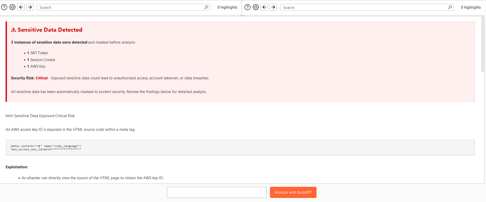

<div align="center">

# BurpGPT Analyzer

</div>

<div align="center">


  <h3>An AI-Powered Security Analysis Extension for BurpSuite</h3>
  
</div>

---

## 📋 Overview

BurpGPT Analyzer revolutionizes web application security testing by bringing artificial intelligence capabilities to Burp Suite. This innovative extension harnesses the power of Google's Gemini AI to automate vulnerability detection, provide intelligent analysis, and assist security professionals in identifying complex security issues.

Whether you're a penetration tester, security researcher, or web security enthusiast, BurpGPT Analyzer enhances your workflow with smart, context-aware security analysis and real-time vulnerability assessments.

<details>
<summary><b>🎯 Key Benefits</b></summary>

- **Automated Security Analysis**: Let AI detect vulnerabilities while you focus on exploitation
- **Time Efficiency**: Reduce manual analysis time by up to 60%
- **Learning Tool**: Understand vulnerabilities through AI-generated explanations
- **Focused Reporting**: Generate concise, actionable security findings
- **Advanced Payload Generation**: Create custom exploit payloads with AI assistance

</details>

## ✨ Features

<table>
  <tr>
    <td width="50%">
      <ul>
        <li>🔐 <b>Intelligent vulnerability scanning</b> of HTTP requests/responses</li>
        <li>⚙️ <b>Detailed technical analysis</b> with exploitation steps</li>
        <li>📊 <b>PoC examples and payloads</b> for confirmed vulnerabilities</li>
        <li>🧩 <b>Seamless integration</b> with Burp Suite's UI and context menu</li>
        <li>🔒 <b>Automatic sensitive data masking</b> for secure AI processing</li>
        <li>🚨 <b>Enhanced detection of exposed credentials</b> and API keys</li>
      </ul>
    </td>
    <td width="50%">
      <ul>
        <li>🧠 <b>AI-powered context-aware analysis</b> of web applications</li>
        <li>🎯 <b>Automated generation</b> of proof-of-concept exploits</li>
        <li>💻 <b>Custom script generation</b> for complex attack scenarios</li>
        <li>🛠️ <b>Payload customization</b> for specific target environments</li>
        <li>🤖 <b>Powered by Google Gemini AI</b> for cutting-edge intelligence</li>
        <li>📱 <b>Improved HTML rendering</b> with responsive vulnerability reports</li>
        <li>⭐ <b>Risk-based categorization</b> with clear severity indicators</li>
      </ul>
    </td>
  </tr>
</table>

## 📸 Screenshots

<div align="center">
  <p><b>BurpGPT Analyzer in action:</b></p>
    <p></p>
  <p><em>Screenshot 1: Main BurpGPT Analyzer interface showing vulnerability analysis</em></p>
  
  <p></p>
  <p><em>Screenshot 2: BurpGPT Settings panel for configuring Gemini API integration</em></p>
  
  <p></p>
  <p><em>Screenshot 3: Sensitive data detection and masking functionality in action</em></p>
</div>

## 🔌 AI Integration

BurpGPT Analyzer leverages Google's powerful Gemini AI models to provide state-of-the-art security analysis:

- **Gemini 1.5 Pro**: Our recommended model for comprehensive, detailed security analysis
- **Gemini 1.5 Flash**: Optimized for speed when you need quick assessments

> **Note**: You'll need to provide your own Gemini API key in the "BurpGPT Settings" tab.

## 🚀 Building the JAR file

<summary><b>From Source</b></summary>

1. Clone the repository:
   ```sh
   git clone https://github.com/nullbytef0x/BurpGPT_Analyzer.git
   ```

2. Navigate to the project directory:
   ```sh
   cd BurpGPT_Analyzer
   ```

3. Build the project using Gradle:
   ```sh
   ./gradlew build
   ```

4. Locate the generated JAR file in the `build/libs` directory.
</details>

<details>
<summary><b>In Burp Suite</b></summary>

1. Open Burp Suite and go to the `Extensions` tab.

2. Click on the `Add` button.

3. In the dialog that appears, select "Java" as the extension type.

4. Click "Select file..." and navigate to the generated JAR file.

5. Click "Next" to complete the installation.
</details>

## 🎮 Usage

1. Once the extension is loaded, you will see a new tab named `BurpGPT Analyzer` in Burp Suite.

2. You can analyze HTTP requests and responses by:
   - Right-clicking on a request in any Burp tool
   - Selecting "Extensions" > "Send to BurpGPT Analyzer"

3. In the `BurpGPT Analyzer` tab, you can:

   <table>
     <tr>
       <td><b>Analysis Options</b></td>
       <td>
         - Enter custom prompts for specific analysis requirements<br>
         - Click "Analyze with BurpGPT" to start the analysis
       </td>
     </tr>
     <tr>
       <td><b>Custom Prompt Examples</b></td>
       <td>
         <code>"Analyze the authentication mechanism in this request"</code><br>
         <code>"Suggest possible SQL injection points in this request"</code><br>
       </td>
     </tr>
   </table>

4. **Best Practices for Prompts**:
   - Be specific about what you want to analyze
   - Include the type of vulnerability you're looking for
   - Ask for specific payload suggestions when needed
   - Request exploitation steps if applicable


## ⚙️ Configuration and Settings

BurpGPT Analyzer provides a comprehensive settings panel accessible through the "BurpGPT Settings" tab in Burp Suite.

### 🖥️ SettingsPanel

<details open>
<summary><b>Key Features</b></summary>

- **API Key Configuration**: Securely enter and store your Gemini AI API key
- **Model Selection**: Choose between Gemini AI models:
  - `gemini-1.5-pro`: Comprehensive model for detailed analysis
  - `gemini-1.5-flash`: Faster model for quicker responses
- **Connection Testing**: Test your API connection before starting analysis
- **Integrated Help**: Built-in instructions for obtaining and testing API keys
- **Configuration Persistence**: Settings are preserved between sessions

</details>

The panel includes user-friendly elements like:
- Interactive help text with step-by-step instructions
- One-click copy function for test commands
- Visual feedback for successful connections
- Error handling with descriptive messages

The settings persist across Burp Suite sessions, ensuring you only need to configure the extension once.

## 🔑 Setting Up Gemini AI

<div align="center">
  
</div>

<table>
  <tr>
    <td width="60%">
      <ol>
        <li>Go to the "BurpGPT Settings" tab</li>
        <li>Enter your Gemini API Key</li>
        <li>Select your preferred Gemini model:
          <ul>
            <li><code>gemini-1.5-pro</code> for comprehensive analysis</li>
            <li><code>gemini-1.5-flash</code> for faster responses</li>
          </ul>
        </li>
        <li>Click "Test Gemini API Connection" to verify your setup</li>
        <li>Click "Save Settings"</li>
      </ol>
    </td>
    <td width="40%">
      <b>To obtain a Google Gemini API key:</b><br>
      1. Visit <a href="https://ai.google.dev/">https://ai.google.dev/</a><br>
      2. Create or select a project<br>
      3. Enable the Gemini API<br>
      4. Generate an API key<br>
      5. Copy the key to BurpGPT Settings
    </td>
  </tr>
</table>

## 💡 Proof-of-Concept Generation

The BurpGPT Analyzer helps security professionals generate and customize proof-of-concept exploits:

### 🛠️ Automated PoC Generation

- Request PoC scripts for detected vulnerabilities
- Get working exploit code examples
- Receive customized payloads for specific scenarios

### 📝 Example PoC Prompts

<div class="code-container" style="background-color: #f5f5f5; padding: 10px; border-radius: 5px;">

```
"Generate a PoC script for this XSS vulnerability"
"Create a Python script to exploit this SQL injection"
"Provide a curl command to reproduce this SSRF vulnerability"
"Generate a working payload to bypass this authentication mechanism"
```

</div>

### 🧩 PoC Customization

- Request language-specific implementations (Python, JavaScript, curl, etc.)
- Get explanations for each part of the exploit
- Receive guidance on safe testing practices

### 📋 Security Testing Workflow

1. Identify vulnerability
2. Generate PoC code
3. Customize exploit parameters
4. Validate the vulnerability
5. Document findings

## 🔐 Sensitive Data Protection

BurpGPT Analyzer prioritizes security with its robust data protection features:

### 🛡️ Automatic Data Masking

<table>
  <tr>
    <td width="50%">
      <b>Protected Data Types:</b>
      <ul>
        <li>API Keys & Tokens</li>
        <li>Authentication Credentials</li>
        <li>Session Identifiers</li>
        <li>JWT Tokens</li>
        <li>Email Addresses</li>
        <li>Credit Card Numbers</li>
        <li>Social Security Numbers (SSNs)</li>
        <li>AWS Access Keys</li>
        <li>Google API Keys</li>
        <li>OAuth Client Secrets</li>
        <li>Private Keys (RSA/DSA/EC)</li>
      </ul>
    </td>
    <td width="50%">
      <b>Security Benefits:</b>
      <ul>
        <li>Protects sensitive data from being shared with AI services</li>
        <li>Transparent notification when masking is applied</li>
        <li>Preserves enough context for accurate analysis</li>
        <li>Automatic detection and categorization of sensitive data</li>
        <li>Clear vulnerability reporting for detected sensitive data</li>
        <li>Risk-based assessment of exposed credentials</li>
      </ul>
    </td>
  </tr>
</table>

<div align="center">
  
</div>

## 📊 Version

<div align="left">
  <b>2025.4.2</b>
</div>

## 👥 Authors

<div align="left">
  <b><a href="https://github.com/nullbytef0x">nullbytef0x</a></b><br>
  <b><a href="https://github.com/Anuththara08">Anuththara08</a></b>
</div>

## 📜 License

<div align="left">
  This project is licensed under the MIT License. You may use, modify, and distribute this code under the terms of the MIT License.
  <br>
  For more details, see the <a href="LICENSE">LICENSE</a> file.
</div>


---

<div align="center">
  <i>Made with ❤️ for the security community</i>
</div>
